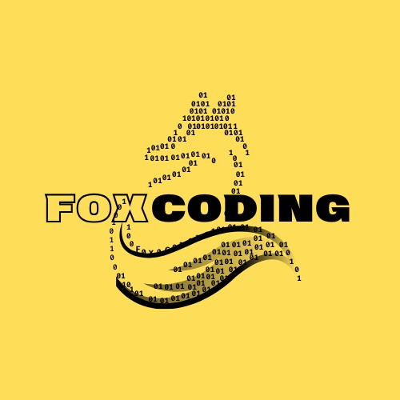

<h1 style="color:yellow"> FoxCoding </h1>

### Desarrolla sin límites

**Repositorio general de proyectos | FoxCoding**

 

## Bienvenidos a FoxCoding

Este repositorio funciona como el **punto central de organización para los proyectos de FoxCoding**.

Su propósito es mantener en un solo lugar la información general, documentación de proyectos, anuncios y organización de los diferentes equipos y proyectos.

Cada proyecto contará con su propio espacio de trabajo, mientras que este repositorio servirá como referencia para toda la comunidad (No se programará directamente en este repositorio).

## 📌 ¿Qué encontrarás aquí?

📢 **Anuncios**  
Información importante, novedades y actualizaciones relacionadas con FoxCoding.

📚 **Documentación**  
Una vez finalizados los proyectos, aquí se mostrará la documentación junto con cualquier apoyo gráfico necesario para comprender el proyecto.

👥 **Grupos de trabajo**  
Organización de los alumnos y equipos participantes.

🚀 **Proyectos**  
Acceso y referencia a los diferentes proyectos desarrollados dentro de FoxCoding.

>Derek Beltrán | *Coordinador de Proyectos*

## 📢 Anuncios

### - **Primer proyecto**
En la siguiente junta hablaremos sobre el primer proyecto, el cual será un **Portfolio** personal donde podrán ir agregando todos sus proyectos a lo largo de la carrera. Es un buen complemento para agregar en un cv ya que tienes más espacio para mostrar tus proyectos.

### - **Siguiente junta**
La siguiente junta será este siguiente sábado 29 de 9 a.m. a 1 p.m. 

Muy probablemente se mantendrá ese horario todas las semanas ya que es un horario en el que todos podemos ir aunque no sea el más cómodo para algunos.

